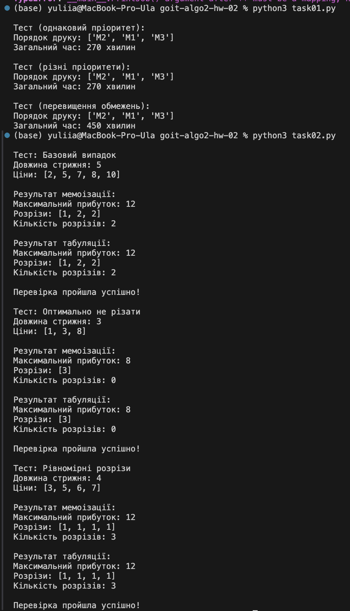

# Домашнє завдання до теми «Жадібні алгоритми та динамічне програмування»

Вітаємо! Як настрiй? Сподiваємося, що ви з нетерпiнням потираєте руки, очікуючи
на новий челлендж 😉

Домашнє завдання буде складатися з двох незалежних завдань. У першому завданні
ви навчитеся оптимізувати чергу завдань на основі пріоритетів та обмежень,
використовуючи жадібні алгоритми для ефективного управління ресурсами. У другому
— застосовувати динамічне програмування для оптимізації рішень, використовуючи
підходи мемоізації та табуляції.

Нехай це домашнє завдання розширить вашу перспективу на світ жадібних алгоритмів
та динамічного програмування! 🧠

## Завдання 1. Оптимізація черги 3D-принтера в університетській лабораторії

Розробіть програму для оптимізації черги завдань 3D-друку з урахуванням
пріоритетів та технічних обмежень принтера, використовуючи жадібний алгоритм.

### Опис завдання

1. Використовуйте вхідні дані у вигляді списку завдань на друк, де кожне
   завдання містить: ID, об'єм моделі, пріоритет та час друку.

2. Реалізуйте основну функцію `optimize_printing`, яка буде:

- Враховувати пріоритети завдань.
- Групувати моделі для одночасного друку.
- Перевіряти обмеження об'єму та кількості.
- Розраховувати загальний час друку.
- Повертати оптимальний порядок друку.

3. Виведіть оптимальний порядок друку та загальний час виконання всіх завдань.

### Технічні умови

1. Очікуваний формат виведення функції `optimize_printing`:

```python
{
    "print_order": ["M1", "M2", "M3"], # порядок друку завдань "total_time": 360 #загальний час у хвилинах
}
```

2. Формат вхідних даних для завдань:

```python
print_jobs = [ {
"id": str, # унікальний ідентифікатор "volume": float, # об'єм в см³ (> 0)
"priority": int, # пріоритет (1, 2 або 3) "print_time": int # часдруку в хвилинах (> 0)
} ]
```

3. Формат обмежень принтера:

```python
printer_constraints = { "max_volume": float, # максимальний об'єм для друку
"max_items": int # максимальна кількість моделей }
```

4. Пріоритети завдань:

- 1 (найвищий) — Курсові/дипломні роботи
- 2 — Лабораторні роботи
- 3 (найнижчий) — Особисті проєкти

### Критерії прийняття

📌Критерії прийняття домашнього завдання є обов’язковою умовою розгляду завдання
ментором. Якщо якийсь з критеріїв не виконано, ДЗ відправляється ментором на
доопрацювання без оцінювання. Якщо вам «тільки уточнити»😉 або ви
«застопорилися» на якомусь з етапів виконання — звертайтеся до ментора у Slack).
Програма групує моделі для одночасного друку, не перевищуючи обмеження (10 б).
Завдання з вищим пріоритетом виконуються раніше (10 б). Час друку групи моделей
розраховується як максимальний час серед моделей у групі (10 б). Програма
обробляє всі тестові сценарії (10 б): завдання однакового пріоритету, завдання
різних пріоритетів, перевищення обмежень принтера. Код використовує dataclass
для структур даних (10 б).

### Шаблон програми

```python
from typing import List, Dict from dataclasses import dataclass

@dataclass class PrintJob: id: str volume: float priority: int print_time: int

@dataclass class PrinterConstraints: max_volume: float max_items: int

def optimize_printing(print_jobs: List[Dict], constraints: Dict) -> Dict: """
Оптимізує чергу 3D-друку згідно з пріоритетами та обмеженнями принтера

    Args:
        print_jobs: Список завдань на друк
        constraints: Обмеження принтера

    Returns:
        Dict з порядком друку та загальним часом
    """
    # Тут повинен бути ваш код

    return {
        "print_order": None,
        "total_time": None
    }

# Тестування

def test_printing_optimization(): # Тест 1: Моделі однакового пріоритету
test1_jobs = [ {"id": "M1", "volume": 100, "priority": 1, "print_time": 120},
{"id": "M2", "volume": 150, "priority": 1, "print_time": 90}, {"id": "M3",
"volume": 120, "priority": 1, "print_time": 150} ]

    # Тест 2: Моделі різних пріоритетів
    test2_jobs = [
        {"id": "M1", "volume": 100, "priority": 2, "print_time": 120},  # лабораторна
        {"id": "M2", "volume": 150, "priority": 1, "print_time": 90},  # дипломна
        {"id": "M3", "volume": 120, "priority": 3, "print_time": 150}  # особистий проєкт
    ]

    # Тест 3: Перевищення обмежень об'єму
    test3_jobs = [
        {"id": "M1", "volume": 250, "priority": 1, "print_time": 180},
        {"id": "M2", "volume": 200, "priority": 1, "print_time": 150},
        {"id": "M3", "volume": 180, "priority": 2, "print_time": 120}
    ]

    constraints = {
        "max_volume": 300,
        "max_items": 2
    }

    print("Тест 1 (однаковий пріоритет):")
    result1 = optimize_printing(test1_jobs, constraints)
    print(f"Порядок друку: {result1['print_order']}")
    print(f"Загальний час: {result1['total_time']} хвилин")

    print("\\nТест 2 (різні пріоритети):")
    result2 = optimize_printing(test2_jobs, constraints)
    print(f"Порядок друку: {result2['print_order']}")
    print(f"Загальний час: {result2['total_time']} хвилин")

    print("\\nТест 3 (перевищення обмежень):")
    result3 = optimize_printing(test3_jobs, constraints)
    print(f"Порядок друку: {result3['print_order']}")
    print(f"Загальний час: {result3['total_time']} хвилин")

if **name** == "**main**": test_printing_optimization()
```

Очікуваний результат:

```python
Тест 1 (однаковий пріоритет): Порядок друку: ['M1', 'M2', 'M3'] Загальний час:
270 хвилин

Тест 2 (різні пріоритети): Порядок друку: ['M2', 'M1', 'M3'] Загальний час: 270
хвилин

Тест 3 (перевищення обмежень): Порядок друку: ['M1', 'M2', 'M3'] Загальний час:
450 хвилин
```

## Завдання 2. Оптимальне розрізання стрижня для максимального прибутку (Rod Cutting Problem)

Розробіть програму для знаходження оптимального способу розрізання стрижня, щоб
отримати максимальний прибуток. Необхідно реалізувати два підходи: через
рекурсію з мемоізацією та через табуляцію.

### Опис завдання

1. На вхід подається довжина стрижня та масив цін, де price[i] — це ціна стрижня
   довжини i+1 .

2. Потрібно визначити, як розрізати стрижень, щоб отримати максимальний
   прибуток.

3. Реалізувати обидва підходи динамічного програмування.

4. Вивести оптимальний спосіб розрізання та максимальний прибуток.

### Технічні умови

1. Формат вхідних даних:

```python
length = 5 # довжина стрижня prices = [2, 5, 7, 8, 10] # ціни для довжин 1, 2,
3, 4, 5
```

2. Обмеження:

- Довжина стрижня > 0.
- Всі ціни > 0.
- Масив цін не може бути порожнім.
- Довжина масиву цін повинна відповідати довжині стрижня.

### Критерії прийняття

1. Програма реалізує два методи (по 10 б за кожний метод):

```python
def rod_cutting_memo(length: int, prices: List[int]) -> Dict: """ Знаходить
оптимальний спосіб розрізання через мемоізацію """ pass

def rod_cutting_table(length: int, prices: List[int]) -> Dict: """ Знаходить
оптимальний спосіб розрізання через табуляцію """ pass
```

2. Кожен метод повертає словник:

- Максимальний прибуток (10 б).
- Список довжин відрізків (10 б).
- Загальну кількість розрізів (10 б).

### Очікуваний формат виведення

```python
{ "max_profit": 12, # максимальний прибуток "cuts": [2, 2, 1], # список довжин
частин "number_of_cuts": 2 # кількість розрізів
}
```

### Шаблон програми:

```python
from typing import List, Dict

def rod_cutting_memo(length: int, prices: List[int]) -> Dict: """ Знаходить
оптимальний спосіб розрізання через мемоізацію

    Args:
        length: довжина стрижня
        prices: список цін, де prices[i] — ціна стрижня довжини i+1

    Returns:
        Dict з максимальним прибутком та списком розрізів
    """

    	# Тут повинен бути ваш код

    return {
        "max_profit": None,
        "cuts": None,
        "number_of_cuts": None
    }

def rod_cutting_table(length: int, prices: List[int]) -> Dict: """ Знаходить
оптимальний спосіб розрізання через табуляцію

    Args:
        length: довжина стрижня
        prices: список цін, де prices[i] — ціна стрижня довжини i+1

    Returns:
        Dict з максимальним прибутком та списком розрізів
    """

    # Тут повинен бути ваш код

    return {
        "max_profit": None,
        "cuts": None,
        "number_of_cuts": None
    }

def run_tests(): """Функція для запуску всіх тестів""" test_cases = [ # Тест 1:
Базовий випадок { "length": 5, "prices": [2, 5, 7, 8, 10], "name": "Базовий
випадок" }, # Тест 2: Оптимально не різати { "length": 3, "prices": [1, 3, 8],
"name": "Оптимально не різати" }, # Тест 3: Всі розрізи по 1 { "length": 4,
"prices": [3, 5, 6, 7], "name": "Рівномірні розрізи" } ]

    for test in test_cases:
        print(f"\\nТест: {test['name']}")
        print(f"Довжина стрижня: {test['length']}")
        print(f"Ціни: {test['prices']}")

        # Тестуємо мемоізацію
        memo_result = rod_cutting_memo(test['length'], test['prices'])
        print("\\nРезультат мемоізації:")
        print(f"Максимальний прибуток: {memo_result['max_profit']}")
        print(f"Розрізи: {memo_result['cuts']}")
        print(f"Кількість розрізів: {memo_result['number_of_cuts']}")

        # Тестуємо табуляцію
        table_result = rod_cutting_table(test['length'], test['prices'])
        print("\\nРезультат табуляції:")
        print(f"Максимальний прибуток: {table_result['max_profit']}")
        print(f"Розрізи: {table_result['cuts']}")
        print(f"Кількість розрізів: {table_result['number_of_cuts']}")

        print("\\nПеревірка пройшла успішно!")

if **name** == "**main**": run_tests()
```

Очікуваний результат:

```python
Тест: Базовий випадок Довжина стрижня: 5 Ціни: [2, 5, 7, 8, 10]

Результат мемоізації: Максимальний прибуток: 12 Розрізи: [1, 2, 2] Кількість
розрізів: 2

Результат табуляції: Максимальний прибуток: 12 Розрізи: [2, 2, 1] Кількість
розрізів: 2

Перевірка пройшла успішно!

Тест: Оптимально не різати Довжина стрижня: 3 Ціни: [1, 3, 8]

Результат мемоізації: Максимальний прибуток: 8 Розрізи: [3] Кількість розрізів:
0

Результат табуляції: Максимальний прибуток: 8 Розрізи: [3] Кількість розрізів: 0

Перевірка пройшла успішно!

Тест: Рівномірні розрізи Довжина стрижня: 4 Ціни: [3, 5, 6, 7]

Результат мемоізації: Максимальний прибуток: 12 Розрізи: [1, 1, 1, 1] Кількість
розрізів: 3

Результат табуляції: Максимальний прибуток: 12 Розрізи: [1, 1, 1, 1] Кількість
розрізів: 3

Перевірка пройшла успішно!
```

## Підготовка та завантаження домашнього завдання

1. Створіть публічний репозиторій goit-algo2-hw-02.

2. Виконайте завдання та відправте його у свій репозиторій.

3. Завантажте робочі файли на свій комп’ютер та прикріпіть їх у LMS у форматі
   zip. Назва архіву повинна бути у форматі ДЗ2_ПІБ.

4. Прикріпіть посилання на репозиторій goit-algo2-hw-02 та відправте на
   перевірку.

## Формат здачі

- Прикріплені файли репозиторію у форматі zip з назвою ДЗ2_ПІБ.
- Посилання на репозиторій.

## Формат оцінювання

Оцінка від 0 до 100.

Завдання 1 оцінюється в 50 балів.

Завдання 2 оцінюється в 50 балів.

Докладний розподіл балів зазначений у критеріях прийняття.

☝🏻 УВАГА!! У вас є можливість обрати підхід до виконання та можливого
доопрацювання домашнього завдання:

1. задовольнитися першою отриманою оцінкою (звісно ж, якщо вона вище прохідного
   бала),
2. намагатися отримати вищий бал шляхом можливого послідуючого доопрацювання
   роботи у відповідності з фідбеком ментора.

Обраний підхід до виконання ДЗ необхідно зазначити у полі для здачі до
прикріпленого завдання. За відсутності коментаря ментор дотримується першого
підходу й виставляє отриману оцінку.

💡 Відправляйте ДЗ на перевірку, коли зроблено все можливе, оскільки кількість
спроб здачі завдання впливає на отриманий бал! За кожну наступну спробу після
другої (тобто з третьої) максимально можлива кількість балів зменшується на 5.
Таким чином: 1 спроба: максимальна кількість балів – 100, 2 спроба: максимальна
кількість балів – 100, 3 спроба: максимальна кількість балів – 95, 4 спроба:
максимальна кількість балів – 90, 5 спроба: максимальна кількість балів – 85,
тощо Критерії оцінювання робіт у магістратурі GoIt Neoversity

### Результат виконаного ДЗ


